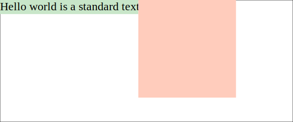
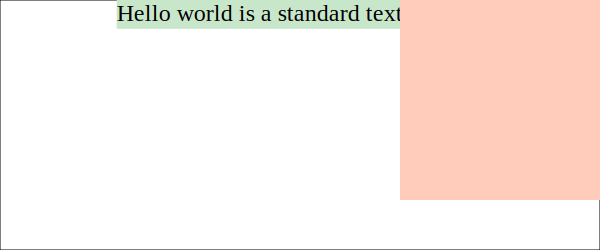
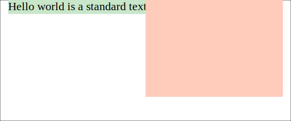
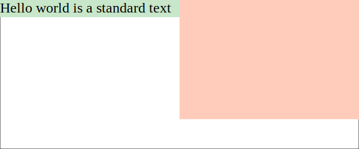

# The Grow/Shrink Layout System - An Alternative to Flexbox
Magnus Holm <judofyr@gmail.com>
2018 July
:toc:

The following document describes the **grow/shrink layout system** which is a
flexible one-dimensional layout system. It's similar in spirit to Flexbox, but
has fewer concepts and is a bit more expressive. We present it here as it would
be implemented for CSS in a browser, but there are currently no implementations
of the system and it's nothing more than an experimental idea. We do think it's
an interesting idea though, and we hope that you will find it interesting as
well.

This document is available on GitHub at https://github.com/judofyr/grow-shrink.
Feel free to leave comments by posting an issue or by sending me an email.

## Informal introduction (with images!)

We start with the following HTML and CSS:

.Initial HTML
****

```html
<div class="main">
  <div class="a">Hello world is a standard text</a>
  <div class="b"></div>
</div>

<style>
.b {
  height: 200px;
  width: 200px;
}

.main {
  layout: horizontal;
}
</style>
```


****

In this example you see the first property of the grow/shrink layout system:
`layout`:

.The `layout` property
****
```
layout: none;
layout: horizontal;
layout: vertical;
```

By setting `layout` to `horizontal` or `vertical` we enable the grow/shrink
layout system for the element. Every child will then be laid out using their
intrinsic size next to each other with no wrapping.
****

The grow/shrink layout system is based on the concept that you first have an
*inital layout* (caused by `layout: horizontal|vertical`) and that leads to
three possible cases:

1. The children fit perfectly inside the container,
2. The children don't fill up the container completely, or
3. The children overflow the container.

In the first case everything is good and there is nothing to do. In the two
other cases we want to apply the `grow` and `shrink` commands respectively.

.Grow/shrink commands
****
The `grow` and `shrink` properties accepts a list of commands. After laying out
elements horizontally or vertical each command will be executed in order.
There's currently three defined commands:

- `size(selector list)`
- `size-equal(selector list)`
- `wrap`

Examples:

```
grow: size(.a);
grow: size-equal(.left, .right) size(.main);
shrink: size(.main) wrap;
```
****

Let's start by showing some examples:

.Growing a single element
****
```html
<style>
.main {
  layout: horizontal;
  grow: size(.a);
}
</style>
```


****

.Growing multiple elements
[[growmult]]
****
```html
<style>
.main {
  layout: horizontal;
  grow: size(.a, .b);
}
</style>
```

image::2-size-ab.svg[]
****

.The `size` command
****
The `size` command takes a list of selectors (which together can match up to
several child elements). When executed, the command will increase/decrease the
size of the child elements at the same rate until the container is
filled up. No element will be sized beyond its min/max-sizing.
****

Grow/shrink is bit different from other layout systems because you need to think
in terms of *steps*. Instead of declaring "this box should take up its full
width if possible", you'll have to think about it as an incremental process:

- "First I want to layout all the items left-to-right ..."
- "and then, if there's more space available, I want to increase the size of `.a` "

The first example (with `grow: size(.a)`) tells us that if there's space
available we want the `.a`-element to grow until (1) it reaches its max-width or
(2) it completely fills up the container. The second example (with `grow:
size(.a, .b)`) grows both elements at the same rate.

### `<space>` pseudo-elements

The real power of grow/shrink comes with its introduction of `<space>`
pseudo-elements:

.`<space>` pseudo-elements:
****
Between every child element, and at the beginning and end of the container,
the grow/shrink layout system inserts `<space>` pseudo-elements which can be
targeted by commands. `space` works as a regular selector and be combined with
`first-child`, `nth-child` and so forth. In addition we define a few custom
pseudo classes to make it easier:

```
space              /* Matches all space elements */
space:first-child  /* The space right at the beginning */
space:outside      /* The space at the beginning/end */
space:inside       /* Opposite of :inside */
.a:space-after     /* The space after an element */
.b:space-before    /* The space before an element */
```

Example:

```
grow: size(space:outside);
```
****


Now things are starting to get interesting.

.Horizontal centering
****
```html
<style>
.main {
  layout: horizontal;
  grow: size(space:outside);
}
</style>
```


****

.Right alignment
****
```html
<style>
.main {
  layout: horizontal;
  grow: size(space:first-child);
}
</style>
```


****

There's not much new to explain here: Imagine that there are `<space>` elements
between every child element (zero-sized by default) and you use `grow: size` as
usual to choose where to distribute the extra space.

This is probably the main contribution of grow/shrink: By introducing `space`
elements and a consistent way of growing/shrinking elements we achieve a great
deal of power with few concepts.

In comparison, Flexbox needs three different concepts/properties (`flex-grow`,
`justify-content`, `margin: auto`), and they have unclear behaviour when mixed
(what happens if you have both `margin: auto` *and* `flex: 1`?). In grow/shrink,
all of these separate concepts are combined under a single property which is
responsible for distributing the extra space:

- `flex: 1` on a single child element becomes `grow: size(.child)`
- `margin-left: auto` on a child element becomes `grow: size(.child:space-before)`
- `justify-content: center` becomes `grow: size(space:outside)`
- `justify-content: space-between` becomes `grow: size(space:inside)`
- `justify-content: space-evenly` becomes `grow: size(space)`
- `justify-content: space-around` is currently not expressible

### Sizing elements together

Sometimes we want to grow elements such that they become equal in size:

.Growing elements to equal size
****
```html
<style>
.main {
  layout: horizontal;
  grow: size-equal(.a, .b);
}
</style>
```


****

.The `size-equal` command
****
The `size-equal` command takes a list of selectors (which together can match up
to several child elements). When executed, the command will increase/decrease
the size of the *smallest/largest* (depending on if we're growing/shrinking)
child elements at the same rate until all elements have the same size or the
container is filled up. No element will be sized beyond its min/max-sizing.
****

`size-equal` is similar to using `flex: 1` on multiple child elements in
Flexbox, but it's slightly more powerful. `size-equal` will stop once the
elements reach they same size which means you can combine it with other commands
to achieve different variants:

.Equal size, then centering
****
```html
<style>
.main {
  layout: horizontal;
  grow: size-equal(.a, .b) size(space:outer);
}
</style>
```


****

.Equal size, then filling the container
****
```html
<style>
.main {
  layout: horizontal;
  grow: size-equal(.a, .b) size(.a, .b);
}
</style>
```


****

### Shrinking elements

So far we've only looked at the `grow` property, but everything we've learnt
also applies to the `shrink` command as well. Shrinking `<space>` elements does
nothing (since they already are zero-sized), but other than that you can
`size` and `size-equal` as expected.

### Wrapping elements

Wrapping children into multiple lines is supported by the `wrap` command:

.The `wrap` command
****
The `wrap` command will, when applied in the `shrink` property, wrap the child
elements into multiple lines. After the line wrapping has been applied, the
`grow` commands will be executed once per line that is now smaller than the
container. If a line is still larger than the container (i.e. there's one child
with intrinsic size larger than the container), the commands after `wrap` in the
`shrink` property will be executed.

Example:

```
shrink: wrap size(*); /* Wrap, then force it to fit the container */
grow: size(*);        /* then fill every line */
```
****

### Aligning along the cross axis

Grow/shrink has no special concept of how the children are positioned inside a
row along the cross axis. We propose to use `align-items` as specified by
the https://drafts.csswg.org/css-align-3/[CSS Box Alignment Module].

## Pending questions and possible extensions

.What happens when min/max-sizing is reached?
In the command `grow: size(.a, .b)` there is a question of what should happen
when one of the elements reach their min/max-sizing. There are two possible
behaviors: Either the whole command aborts, or the remaining elements continue
growing/shrinking. The disadvantage of the first approach is that it might not
be a very useful behavior; the advantage is that with you can still accomplish
the second behavior by using `grow: size(.a, .b) size(.b)`.

.Should `size` support different ratios?
```css
/* Not sure about the syntax */
grow: size-equal(2 / .a, .b; 1 / .c)

/* But this would be similar to: */
.a, .b { flex: 2 }
.c { flez: 1 }
```

.Generic `property` command
It could be interesting to investigate a generic `property` command: `shrink:
property(font-size by 5px on .a)`.

## Implementation notes

There's currently no implementation of the grow/shrink layout system, but it's
our impression that it would be rather trivial to implement. The system itself
is built around the concept of incremental steps which maps cleanly to an
algorithm.

## Related work and inspirations

Here's a short summary of the layout systems that we've used, and how they
related to grow/shrink.

### Constraint-based layout systems

A constraint-based layout system is maybe the most expressive and most
general layout system there is. It uses very few concepts (contraints between
positions) and can accomplish an impressive set of layouts. This
expressiveness comes at a cost:

- You often need multiple constraints to accomplish simple layouts. Often you
  need to introduce a separate "language" to simplify the creation of
  constraints.
- You need the perfect amount of constraints: Too few constraints and there are
  multiple possible layouts; too many constraints and there is no possible
  layout.
- Creating layout for container that can contain a dynamic amount of children is
  a bit unclear.
- The implementation is non-trivial.

We consider constraint-based layout systems as "the Turing machine of layout
systems": Extremely powerful to the extent that it is difficult to reason about
(both for humans and for computers). And just like Turing machines, we would
prefer if we could find a weaker (easier-to-reason-about) model that still
solves our problem.

### Flexbox

https://www.w3.org/TR/css-flexbox-1/[Flexbox] is a layout system that, in our
experience, solves 95% of the useful (one-dimensional layout) in a sensible way.
Grow/shrink is heavily based on the core concepts behind Flexbox (main axis,
intrinsic sizing + growing/shrinking). We're quite happy with Flexbox being a
well-supported layout system on the web today.

### Subform

https://subformapp.com/[Subform] is a (closed-source) application for creating
dynamic UI layouts for mockups and demos. They recently wrote an article about
why they ended up creating their own layout system instead of using Flexbox:
https://subformapp.com/articles/why-not-flexbox/["Why Not Flexbox?"].

They introduce a few interesting concepts:

- A stretch unit (`1s`) which can be applied to both margins and widths/heights.
- The cross axis behaves as a main axis with a single element. `align-items:
  strech` becomes `height: 1s`, and `align-items: flex-end` becomes `before: 1s`.

### Tiling algebra for constraint-based layout system

There's surprisingly few research papers about different layout systems. It
seems that the research community has decided that layout system is a solved
problem by the constraint-based approach, and most research is focused on
providing an efficient implementation. Very little attention is spent on the
language/format we use to declare layouts.

One notable exception we found interesting is
https://www.sciencedirect.com/science/article/pii/S2352220817300238[Tiling
algebra for constraint-based layout editing (2017)] by Zeidler, Weber,
Gavryushkin,  Lutteroth
(https://www.cs.auckland.ac.nz/~clemens/page/publications/Zeidler-2017-TilingAlgebra.pdf[PDF]).
This paper describes a _tiling algebra_ for two-dimensional layout.

For instance, the following specification defines an aligned grid of 2x2:

```
(A|B)/(C|D)
  x     x
```

The pipe operator denotes that the two elements should be stacked horizontally,
while the slash operator stacks elements vertically. The letter beneath an
operator is the _tab stop_. Here we declare that A|B and C|D should share the
same tab stop, forcing A and C (and B and D) to have the same width.

The paper explains how you can take the tiling algebra and build the necessary
constraints that will fulfill the layout. The biggest contribution is that the
algebra can guarantee that the layout is sound (i.e. solvable).

We're only focusing on one-dimensional layout in grow/shrink and as such the
paper is not very applicable, but we felt it deserved a mention due to its focus
on providing a language/algebra to reason about layouts.

### GTK/Qt

We unfortunately have little experience with the layout system of other
platforms, such as GTK and Qt.

## Conclusion and the way forward

In this document we have presented the *grow/shrink layout system* through an
informal specification with examples. We have currently no intention of writing
a full formal specification (for the browser), but is mainly putting this
document out in the world in hope that it will be useful for someone.

